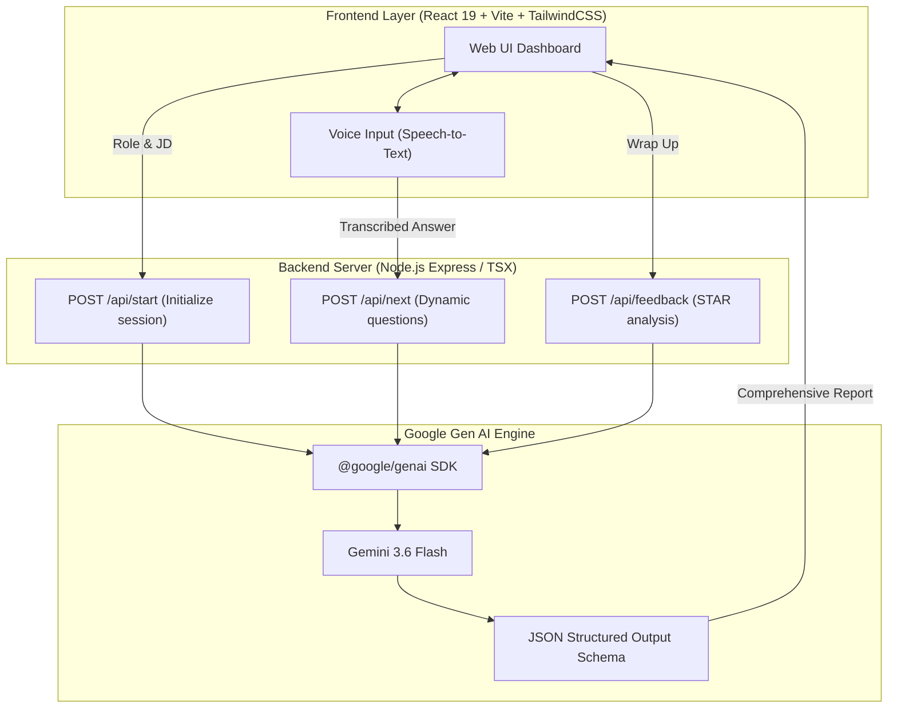

# 🧠 IQ Coach - AI Interview Prep for Global Tech Roles

> 🏆 **Project Submission for Google Meet the Builders — Gen AI Academy APAC (Cohort 3)**  
> **Official Campaign Hashtags**: `#Meetthebuilders` `#GenAIAcademyAPAC` `#Cohort3`

**IQ Coach** is an intelligent AI Assessment & Mock Interview Coach designed to empower Vietnamese and APAC software engineers to master international technical and behavioral interviews. Powered by **Google Gemini 3.6 Flash** via the new `@google/genai` SDK, it simulates dynamic, context-aware job interviews, delivers real-time voice feedback, and provides structured evaluations based on the **STAR framework** (Situation, Task, Action, Result).

---

## 🌏 Local Problem & Mission

Vietnam has an extraordinary talent pool of software engineers who excel in coding and algorithmic thinking. However, when applying to global technology firms and multinational corporations (MNCs), many encounter a steep barrier:
* **English Technical Communication Anxiety**: Struggling to articulate complex architecture decisions fluently under interview pressure.
* **Lack of STAR Methodology Grounding**: Answering questions with purely technical narratives without highlighting measurable impact and clear personal ownership.
* **High Cost of Human Mentorship**: Hiring native-speaking interview mentors costs between $50–$150/hour, which is out of reach for many early-career builders.

**IQ Coach bridges this gap** by providing an accessible, private, 24/7 AI-powered mock interview environment.

---

## ✨ Key Features

* 🎯 **Context-Aware Dynamic Questioning**: Analyzes specific **Job Title** and **Job Description (JD)** inputs to craft tailored technical and behavioral questions.
* 🎙️ **Interactive Spoken Simulation**: Integrated Speech-to-Text (STT) and Text-to-Speech (TTS) capabilities for hands-free, voice-driven mock interviews.
* ⚡ **Ultra-Low Latency Conversation**: Harnesses **Gemini 3.6 Flash** for rapid, multi-turn dialogue that feels like speaking with a real Engineering Lead.
* 📊 **Automated STAR & Grammar Diagnostics**:
  * Evaluates responses against the STAR framework.
  * Exact phrase-level grammar corrections and vocabulary enhancements.
  * Cultural fit scoring and actionable suggested answers.

---

## 🏗️ System Architecture



---

## 🚀 Quick Start Guide

### 📋 Prerequisites
* **Node.js**: v18.0.0 or higher
* **Google Gemini API Key**: Obtainable from [Google AI Studio](https://aistudio.google.com/)

### 🛠️ Step 1: Clone and Install Dependencies
```bash
git clone <your-repo-url>
cd iq-coach-ai-interview-prep
npm install
```

### 🔑 Step 2: Configure Environment Variables
Create a `.env` file in the root directory:
```bash
cp .env.example .env
```
Open `.env` and add your Gemini API key:
```env
GEMINI_API_KEY=your_gemini_api_key_here
```

### 💻 Step 3: Run the Development Server
```bash
npm run dev
```
Open your browser and navigate to **`http://localhost:3000`** to start practicing with **IQ Coach**!

---

## 🧪 Synthetic Data & Privacy Statement

This application strictly operates using synthetic sample data and user-provided job descriptions. No personal identifiable information (PII) or proprietary corporate interview questions are stored or exposed.

---

## 📜 License

Distributed under the Apache-2.0 License. See `LICENSE` for more information.
